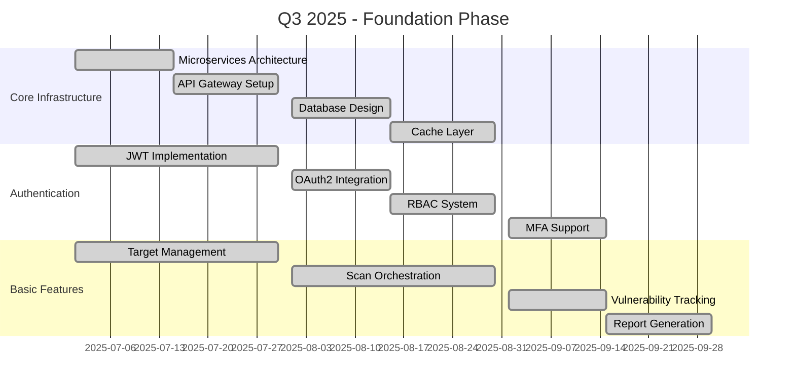
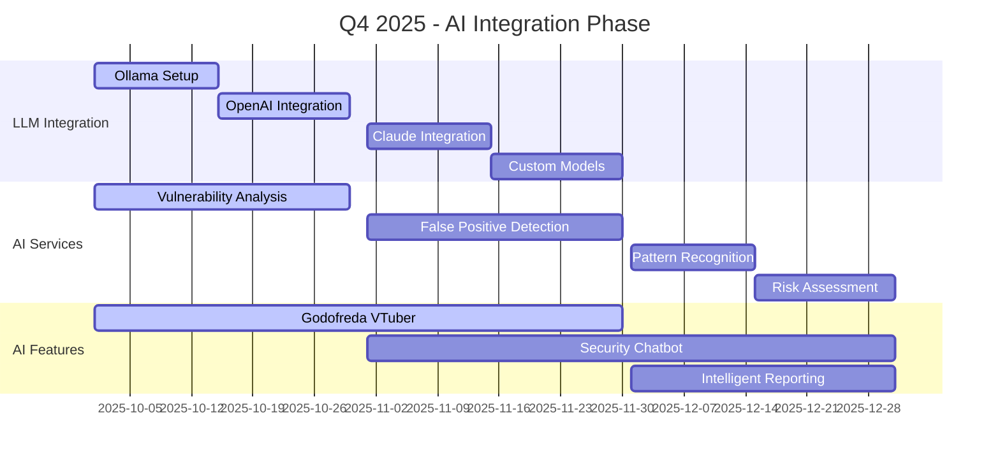
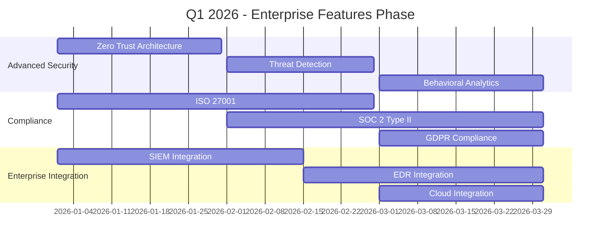

# 🗺️ Securet Flow SSC - Roadmaps Documentation

## 🎯 Visão Geral dos Roadmaps

Esta documentação apresenta os roadmaps estratégicos do **Securet Flow SSC**, incluindo o planejamento de desenvolvimento, cronogramas, metas e objetivos para as próximas versões da plataforma.

## 📅 Roadmaps Estratégicos

### **Versões Planejadas**
```yaml
Version Roadmap:
  Current Version: 4.0.0-master
  Next Release: 4.1.0 (Q4 2025)
  Major Release: 5.0.0 (Q2 2026)
  
  Version History:
    v1.0.0: Initial Release (Q1 2024)
    v2.0.0: Enhanced Features (Q3 2024)
    v3.0.0: AI Integration (Q1 2025)
    v4.0.0: Enterprise Features (Q3 2025)
    v5.0.0: Advanced AI & ML (Q2 2026)
```

## 🚀 Roadmap V4 Master (Atual)

### **Fase 1: Foundation (Q3 2025)**
```yaml
Foundation Phase:
  Core Infrastructure:
    - ✅ Microservices Architecture
    - ✅ API Gateway (Kong)
    - ✅ Database Design (PostgreSQL)
    - ✅ Cache Layer (Redis)
    - ✅ Search Engine (Elasticsearch)
  
  Authentication & Security:
    - ✅ JWT Authentication
    - ✅ OAuth2 Integration
    - ✅ RBAC Implementation
    - ✅ MFA Support
    - ✅ Audit Logging
  
  Basic Features:
    - ✅ Target Management
    - ✅ Scan Orchestration
    - ✅ Vulnerability Tracking
    - ✅ Report Generation
    - ✅ User Management
```

### **Fase 2: AI Integration (Q4 2025)**
```yaml
AI Integration Phase:
  LLM Integration:
    - 🔄 Ollama Local LLMs
    - 🔄 OpenAI GPT-4 Integration
    - 🔄 Anthropic Claude Integration
    - 🔄 Custom Fine-tuned Models
  
  AI Services:
    - 🔄 Intelligent Vulnerability Analysis
    - 🔄 False Positive Detection
    - 🔄 Pattern Recognition
    - 🔄 Risk Assessment
    - 🔄 Recommendation Engine
  
  AI Features:
    - 🔄 Godofreda VTuber
    - 🔄 Security Chatbot
    - 🔄 Intelligent Reporting
    - 🔄 Predictive Analytics
```

### **Fase 3: Enterprise Features (Q1 2026)**
```yaml
Enterprise Features Phase:
  Advanced Security:
    - 📋 Zero Trust Architecture
    - 📋 Advanced Threat Detection
    - 📋 Behavioral Analytics
    - 📋 Threat Intelligence Integration
  
  Compliance & Governance:
    - 📋 ISO 27001 Compliance
    - 📋 SOC 2 Type II Certification
    - 📋 GDPR Compliance
    - 📋 PCI DSS Support
  
  Enterprise Integration:
    - 📋 SIEM Integration
    - 📋 EDR Integration
    - 📋 Cloud Provider Integration
    - 📋 Identity Provider Integration
```

### **Fase 4: Advanced Analytics (Q2 2026)**
```yaml
Advanced Analytics Phase:
  Machine Learning:
    - 📋 ML-powered Vulnerability Prediction
    - 📋 Anomaly Detection
    - 📋 Risk Scoring Models
    - 📋 Automated Remediation
  
  Advanced Reporting:
    - 📋 Executive Dashboards
    - 📋 Custom Report Builder
    - 📋 Automated Compliance Reports
    - 📋 Trend Analysis
  
  Performance Optimization:
    - 📋 Scalability Improvements
    - 📋 Performance Monitoring
    - 📋 Load Balancing
    - 📋 Caching Optimization
```

## 🔮 Roadmap V5.0 (Futuro)

### **Fase 1: Advanced AI & ML (Q2 2026)**
```yaml
Advanced AI Phase:
  Deep Learning:
    - 📋 Neural Network Models
    - 📋 Deep Learning for Threat Detection
    - 📋 Natural Language Processing
    - 📋 Computer Vision for Security
  
  Autonomous Security:
    - 📋 Automated Threat Response
    - 📋 Self-healing Systems
    - 📋 Predictive Maintenance
    - 📋 Autonomous Remediation
  
  AI Agents:
    - 📋 Multi-Agent Systems
    - 📋 Collaborative AI Agents
    - 📋 Autonomous Security Agents
    - 📋 AI-powered Red Teaming
```

### **Fase 2: Quantum Security (Q3 2026)**
```yaml
Quantum Security Phase:
  Quantum Computing:
    - 📋 Quantum-resistant Cryptography
    - 📋 Quantum Key Distribution
    - 📋 Post-quantum Security
    - 📋 Quantum Threat Assessment
  
  Advanced Cryptography:
    - 📋 Homomorphic Encryption
    - 📋 Zero-knowledge Proofs
    - 📋 Secure Multi-party Computation
    - 📋 Blockchain Security
```

### **Fase 3: Global Scale (Q4 2026)**
```yaml
Global Scale Phase:
  Multi-cloud Support:
    - 📋 AWS Integration
    - 📋 Azure Integration
    - 📋 Google Cloud Integration
    - 📋 Hybrid Cloud Support
  
  Global Distribution:
    - 📋 Multi-region Deployment
    - 📋 Edge Computing
    - 📋 CDN Integration
    - 📋 Global Load Balancing
  
  International Compliance:
    - 📋 Regional Compliance
    - 📋 Data Sovereignty
    - 📋 International Standards
    - 📋 Local Regulations
```

## 📊 Cronograma Detalhado

### **Q3 2025 - Foundation**


### **Q4 2025 - AI Integration**


### **Q1 2026 - Enterprise Features**


## 🎯 Metas e Objetivos

### **Objetivos de Curto Prazo (3-6 meses)**
```yaml
Short-term Goals:
  Technical:
    - Complete AI integration
    - Implement advanced security features
    - Optimize performance and scalability
    - Enhance user experience
  
  Business:
    - Achieve 1000+ active users
    - Establish partnerships with security vendors
    - Launch enterprise pricing tiers
    - Obtain security certifications
  
  Product:
    - Release Godofreda VTuber
    - Launch security chatbot
    - Implement predictive analytics
    - Create advanced reporting features
```

### **Objetivos de Médio Prazo (6-12 meses)**
```yaml
Medium-term Goals:
  Technical:
    - Implement quantum-resistant security
    - Develop autonomous security systems
    - Create multi-agent AI systems
    - Build global infrastructure
  
  Business:
    - Expand to international markets
    - Achieve 10,000+ active users
    - Establish enterprise partnerships
    - Launch cloud-native version
  
  Product:
    - Release autonomous security agents
    - Implement quantum security features
    - Create global compliance framework
    - Develop advanced threat intelligence
```

### **Objetivos de Longo Prazo (1-2 anos)**
```yaml
Long-term Goals:
  Technical:
    - Lead quantum security innovation
    - Develop next-generation AI systems
    - Create autonomous security ecosystem
    - Build global security platform
  
  Business:
    - Become industry leader
    - Achieve 100,000+ active users
    - Establish global presence
    - Create security standards
  
  Product:
    - Pioneer quantum security solutions
    - Create autonomous security paradigm
    - Establish global security framework
    - Develop comprehensive security ecosystem
```

## 📈 Métricas de Sucesso

### **Métricas Técnicas**
```yaml
Technical Metrics:
  Performance:
    - API Response Time: < 200ms
    - Scan Completion Time: < 30 minutes
    - System Uptime: > 99.9%
    - Concurrent Users: > 10,000
  
  Security:
    - Zero Critical Vulnerabilities
    - Security Incident Response: < 1 hour
    - False Positive Rate: < 5%
    - Threat Detection Accuracy: > 95%
  
  AI/ML:
    - Model Accuracy: > 90%
    - Prediction Success Rate: > 85%
    - False Positive Reduction: > 50%
    - Automated Remediation: > 70%
```

### **Métricas de Negócio**
```yaml
Business Metrics:
  User Growth:
    - Monthly Active Users: 10,000+
    - User Retention Rate: > 80%
    - Customer Satisfaction: > 4.5/5
    - Net Promoter Score: > 50
  
  Revenue:
    - Monthly Recurring Revenue: $100K+
    - Annual Growth Rate: > 200%
    - Customer Lifetime Value: $10K+
    - Churn Rate: < 5%
  
  Market:
    - Market Share: Top 5 in category
    - Brand Recognition: > 60%
    - Partnership Growth: > 20/year
    - International Expansion: 10+ countries
```

## 🔄 Processo de Desenvolvimento

### **Metodologia Ágil**
```yaml
Development Methodology:
  Framework: Scrum
  Sprint Duration: 2 weeks
  Team Size: 8-12 developers
  Ceremonies:
    - Daily Standup
    - Sprint Planning
    - Sprint Review
    - Sprint Retrospective
  
  Tools:
    - Jira (Project Management)
    - GitHub (Version Control)
    - Slack (Communication)
    - Confluence (Documentation)
```

### **Ciclo de Release**
```yaml
Release Cycle:
  Major Release: Quarterly
  Minor Release: Monthly
  Patch Release: Weekly
  Hotfix: As needed
  
  Release Process:
    1. Feature Development
    2. Code Review
    3. Testing (Unit, Integration, E2E)
    4. Security Review
    5. Performance Testing
    6. User Acceptance Testing
    7. Production Deployment
    8. Post-release Monitoring
```

## 📚 Documentação Adicional

### **Links Úteis**
- [🗺️ Roadmap V4 Master](v4-master-roadmap.md)
- [📋 Roadmap V3 Complete](v3-complete.md)
- [🔮 Planos Futuros](future-plans.md)
- [📊 Métricas e KPIs](metrics-kpis.md)

### **APIs**
- [📊 Roadmap API](../api/README.md#roadmap-endpoints)
- [🔗 Backend Roadmap Services](../backend/README.md)

### **Ferramentas**
- [🛠️ Ferramentas de Planejamento](../tools/README.md)

---

**Última atualização**: 27 de Agosto de 2025  
**Versão**: 4.0.0-master  
**Status**: ✅ **Documentação de Roadmaps Completa** 